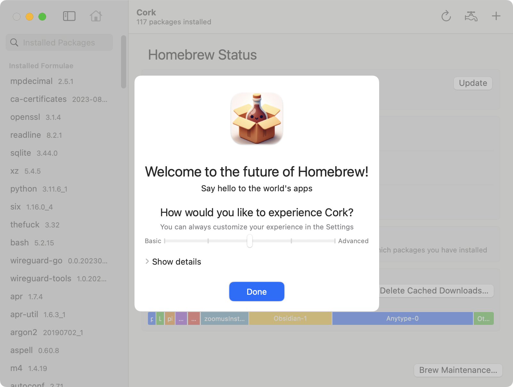

When you start up Cork for the first time, you will see the **Onboarding** screen. It lets you select how complex of an experience you'd like to have by sliding the slider on the *Basic ↔ Advanced* axis.

Click **Show details** to see exactly which features will be turned on and off for each complexity level

You can bring this onboarding screen up again at any time by clicking **Cork** in the Menu Bar, then selecting **Show Onboarding…**.

## Next Steps

Now that you have set Cork up, read about the [User Interface](/user-interface/main.html), discover [what you can do with Cork](/package-operations/main.html), or learn more about how you can [customize Cork](/settings/main.html).