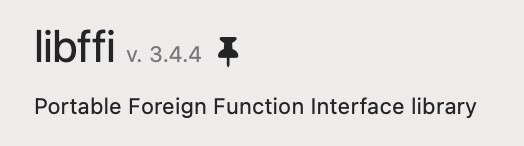

If you want to keep a package at its current version, you can **pin** it to stop it from being updated. Note that Homebrew might update a pinned package regardless in case the package is a dependency of another package that is not pinned.

A pinned package will have a pin icon next to its name:

## Pin a Package

To pin a package:

1. Open its [Detail Page](/user-interface/detail-area/detail-page.html)
2. Click `Pin to version [version]` at the bottom of the Detail Page

## Unpin a Package

To unpin a package:

1. Open its [Detail Page](/user-interface/detail-area/detail-page.html)
2. Click `Unpin from version [version]` at the bottom of the Detail Page
